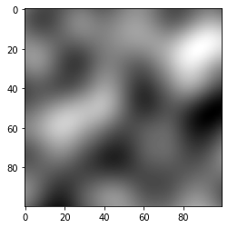
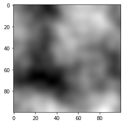

Smooth random noise generator  
read more https://en.wikipedia.org/wiki/Perlin_noise  


noise = PerlinNoise(octaves=3.5, seed=777)  
 &nbsp;&nbsp;&nbsp;&nbsp;octaves : number of sub rectangles in each [0, 1] range  
 &nbsp;&nbsp;&nbsp;&nbsp;seed : specific seed with which you want to initialize random generator  


```python
from perlin_noise import PerlinNoise
noise = PerlinNoise()
# accepts as argument intenger and list
noise(0.5) == noise([0.5])
# --> True
# noise not limited in space dimension and seamless in any space size
noise([0.5, 0.5]) == noise([0.5, 0.5, 0, 0, 0])
# --> True
```

Usage examples:
```python
import matplotlib.pyplot as plt
from perlin_noise import PerlinNoise

noise = PerlinNoise(octaves=10, seed=1)
xpix, ypix = 100, 100
pic = [[noise([i/xpix, j/ypix]) for j in range(xpix)] for i in range(ypix)]

plt.imshow(pic, cmap='gray')
plt.show()
```


```python
import matplotlib.pyplot as plt
from perlin_noise import PerlinNoise

noise1 = PerlinNoise(octaves=3)
noise2 = PerlinNoise(octaves=6)
noise3 = PerlinNoise(octaves=12)
noise4 = PerlinNoise(octaves=24)

xpix, ypix = 100, 100
pic = []
for i in range(xpix):
    row = []
    for j in range(ypix):
        noise_val = noise1([i/xpix, j/ypix])
        noise_val += 0.5 * noise2([i/xpix, j/ypix])
        noise_val += 0.25 * noise3([i/xpix, j/ypix])
        noise_val += 0.125 * noise4([i/xpix, j/ypix])

        row.append(noise_val)
    pic.append(row)

plt.imshow(pic, cmap='gray')
plt.show()
```


